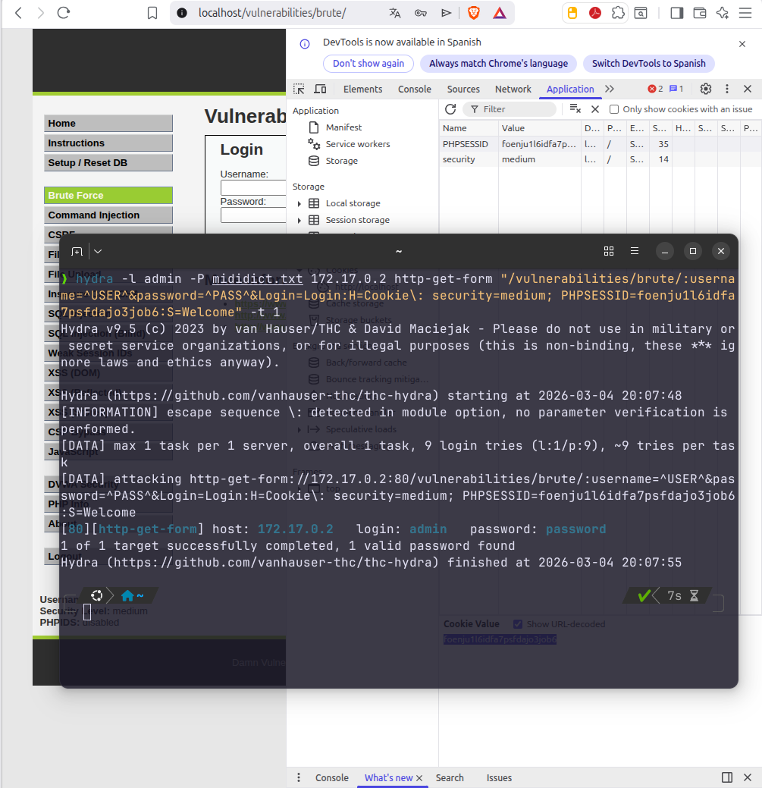

# 1. Ataque de Fuerza Bruta (Brute Force)

## Descripción
El objetivo de esta fase es obtener acceso ilícito a la sección administrativa mediante un ataque de diccionario automatizado. En el nivel **Medium**, DVWA introduce pequeñas latencias tras intentos fallidos para dificultar el proceso; sin embargo, el sistema sigue siendo vulnerable al no implementar un mecanismo de bloqueo de cuenta (*Account Lockout*).

---

## 1.1. Identificación de vectores y herramientas
Para la explotación se utilizó **Hydra**, una herramienta de red de alto rendimiento. Para configurar el ataque correctamente, se capturaron tres elementos clave mediante la interceptación de la petición HTTP:

* **URL del formulario**: `/vulnerabilities/brute/`
* **Parámetros de sesión**: Cookie `PHPSESSID` y el nivel de seguridad configurado.
* **Indicadores de respuesta**: El mensaje de éxito y error para que la herramienta identifique la credencial válida.

*Evidencia de la configuración y ejecución del ataque.*

---

## 1.2. Análisis de resultados
Como se evidencia en la captura anterior, el ataque se configuró con una velocidad de una tarea por servidor (`-t 1`) para evitar la denegación de servicio del contenedor. Hydra logró localizar la credencial válida en un tiempo de **7 segundos**.

---

## 1.3. Conclusión técnica
La seguridad implementada en el nivel Medium es insuficiente, ya que se limita a un retardo temporal que no detiene las herramientas de automatización modernas. 

Para asegurar este vector en un entorno de producción, se recomienda:
1. **Implementar Account Lockout**: Bloquear la cuenta o la IP tras un número específico de intentos fallidos.
2. **Uso de CAPTCHA**: Introducir un desafío visual para distinguir humanos de bots.
3. **Segundo Factor de Autenticación (2FA)**: Añadir una capa adicional de seguridad más allá de la contraseña.
