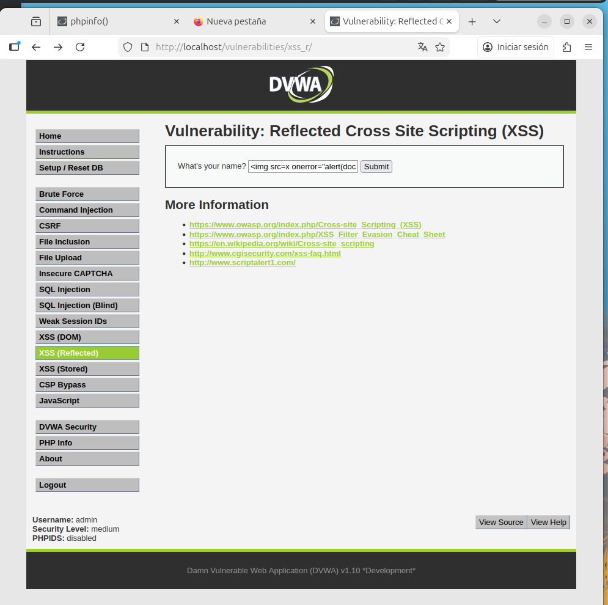

# 10. Reflected Cross Site Scripting (XSS)

## Descripción
El **XSS Reflejado** ocurre cuando una aplicación web recibe datos en una petición HTTP (normalmente vía parámetros URL o formularios) y los incluye de forma inmediata en la respuesta HTML sin el saneamiento adecuado. A diferencia del DOM XSS, este ataque requiere que el payload sea enviado al servidor para que este lo "rebote" de vuelta al navegador de la víctima.

---

## 10.1. Análisis de niveles y evasión

### Nivel Low
La aplicación solicita un nombre a través de un campo de texto y lo concatena directamente en el mensaje de bienvenida. Al no filtrar caracteres especiales (como `< > " '`), el navegador interpreta cualquier código HTML o JavaScript inyectado como parte legítima de la estructura de la página.

### Nivel Medium
En este nivel, el desarrollador implementa un filtro de sustitución (generalmente mediante `str_replace()`) para eliminar la cadena `<script>` de la entrada del usuario. Esta medida intenta prevenir la ejecución de scripts, pero es extremadamente frágil ante vectores alternativos.

---

## 10.2. Evidencia de explotación
Para evadir el filtro del nivel Medium, se utilizó un payload que no emplea la etiqueta prohibida. Se optó por una etiqueta de imagen con un manejador de eventos que ejecuta JavaScript automáticamente al fallar la carga de una fuente inexistente.

**Payload utilizado:**
``

Como el filtro solo busca la palabra "script", la etiqueta `` pasa desapercibida por el servidor y es enviada de vuelta al navegador, donde se ejecuta el evento `onerror`.

---

## 10.3. Conclusión Técnica (Remediación)
Esta prueba demuestra que las **listas negras** de palabras prohibidas son una medida de seguridad fallida. Un atacante siempre buscará una etiqueta (como ``, `<iframe>`, `<svg>`) o un evento alternativo (`onmouseover`, `onload`, `onclick`) para ejecutar el código.

**Medidas de Hardening recomendadas:**
1. **Codificación de Salida (Output Encoding)**: Convertir caracteres especiales en sus entidades HTML equivalentes (ej. `<` se convierte en `&lt;`) antes de renderizarlos. Esto hace que el navegador muestre el código como texto en lugar de ejecutarlo.
2. **Validación de Entradas**: Asegurar que la entrada coincida con el formato esperado (ej. si se pide un nombre, solo permitir caracteres alfabéticos).
3. **Uso de cabeceras de seguridad**: Configurar `X-XSS-Protection: 1; mode=block` en el servidor web.
