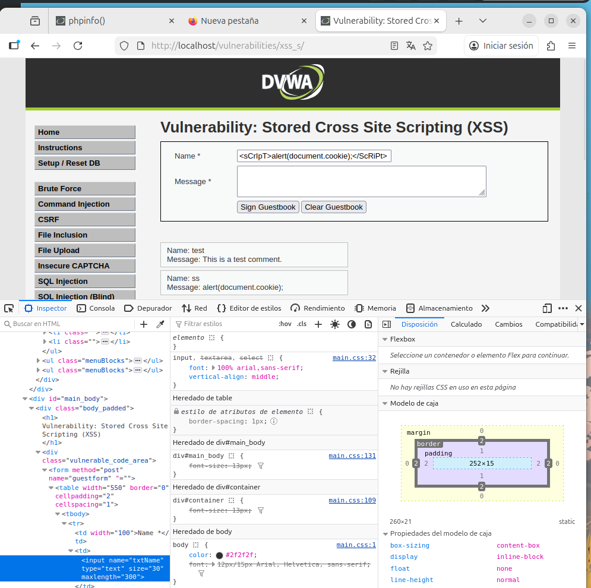
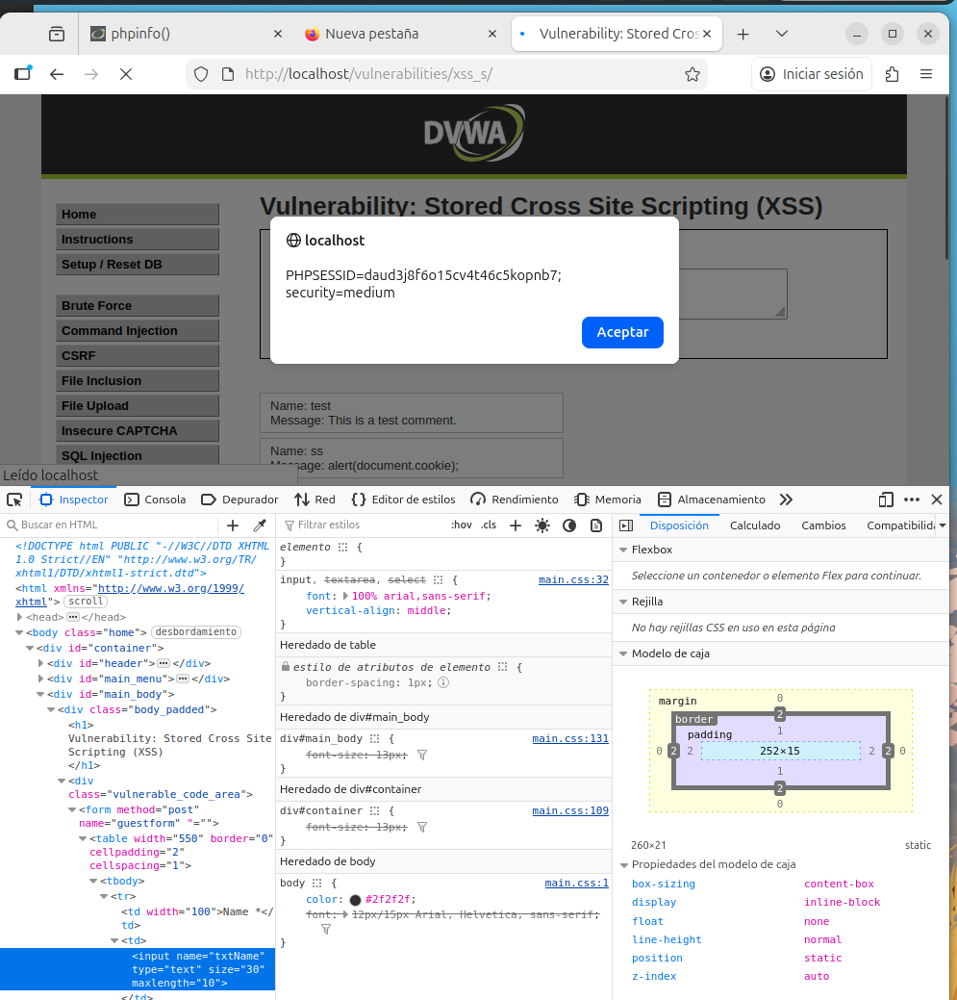

# 11. Stored Cross-Site Scripting (XSS Persistente)

## Descripción
El **XSS Almacenado** ocurre cuando una aplicación recibe datos de un usuario y los guarda en su base de datos sin filtrarlos. Posteriormente, esos datos se renderizan en el navegador de cualquier usuario que visite la sección afectada. Es el vector más crítico de XSS, ya que el ataque es automático, permanente y no requiere que la víctima haga clic en un enlace malicioso.

---

## 11.1. Análisis de niveles y evasión

### Nivel Low
En este nivel, el campo de mensaje del "Libro de Visitas" (*Guestbook*) no posee ninguna restricción. Cualquier payload inyectado se guarda directamente en la base de datos y se ejecuta cada vez que un usuario accede a la página para leer los comentarios.

### Nivel Medium
El desarrollador intenta bloquear el ataque mediante dos métodos insuficientes:
1. **Restricción en el cliente**: Un atributo `maxlength` en el HTML para limitar la longitud del mensaje.
2. **Lista negra en el servidor**: Un filtro que busca y elimina la cadena exacta `<script>`.

---

## 11.2. Evidencia de explotación
Para superar las defensas del nivel Medium, se aplicaron dos técnicas de bypass:

1. **Manipulación del DOM**: Se utilizaron las **DevTools** del navegador para localizar el elemento HTML y eliminar manualmente la restricción `maxlength`, permitiendo el envío de payloads largos.
2. **Case-Switching**: Para evadir el filtro del servidor, se alternaron mayúsculas y minúsculas en la etiqueta: `<sCrIpT>`. Como el filtro no es sensible a mayúsculas (*case-insensitive*), no detecta la palabra prohibida y permite su almacenamiento.

### Resultado
Una vez guardado, el script se ejecuta automáticamente para cada visitante, demostrando la persistencia del ataque.

---

## 11.3. Conclusión Técnica (Remediación)
El XSS almacenado demuestra que la **seguridad basada en el cliente** (como el `maxlength`) es inexistente, ya que el usuario tiene control total sobre el código que ejecuta su navegador.

**Medidas de Hardening recomendadas:**
1. **Sanitización en la entrada**: Limpiar los datos en el servidor antes de guardarlos en la base de datos utilizando librerías como *HTML Purifier*.
2. **Codificación en la salida**: Usar funciones como `htmlspecialchars()` en PHP al renderizar los datos, asegurando que el navegador trate el contenido como texto plano.
3. **Content Security Policy (CSP)**: Bloquear la ejecución de scripts no autorizados mediante políticas de cabecera HTTP.
