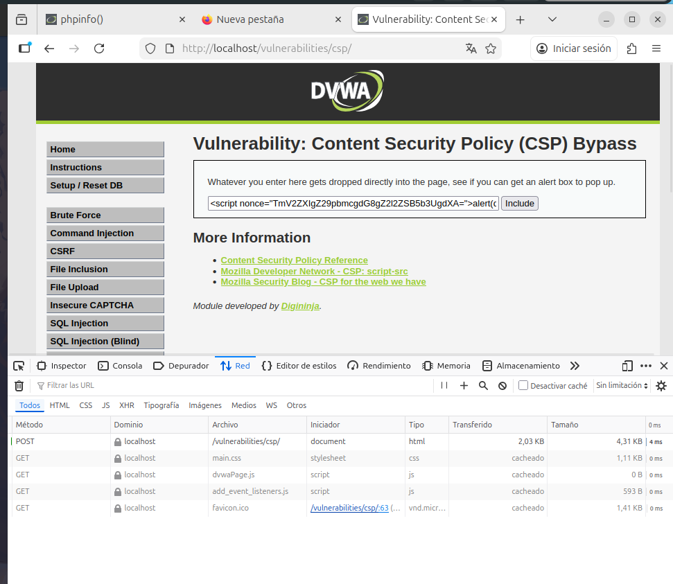
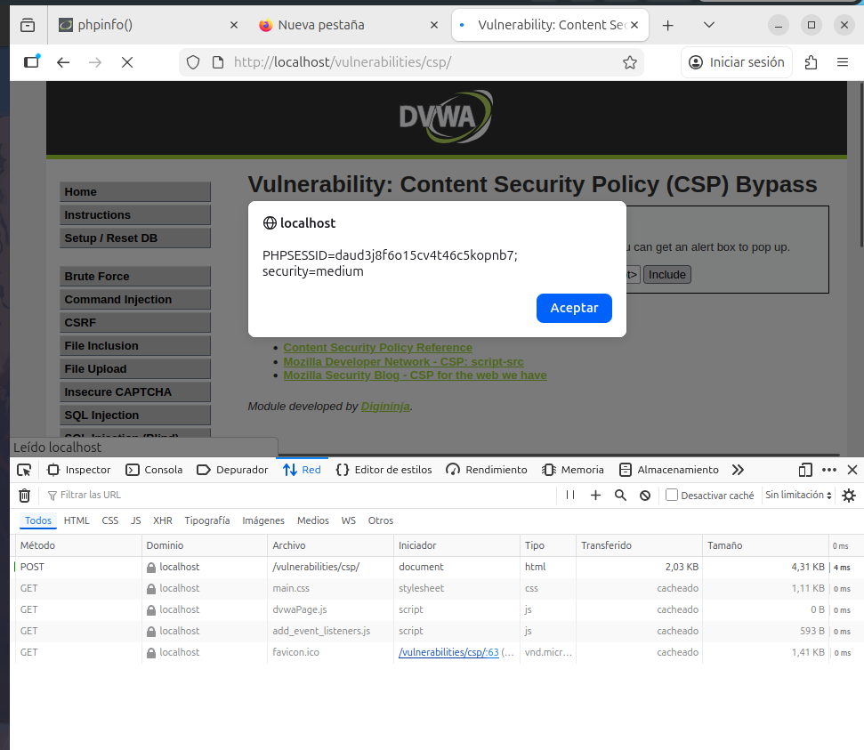

# 12. Content Security Policy (CSP) Bypass

## Descripción
La política **CSP (Content Security Policy)** es una capa de seguridad adicional diseñada para detectar y mitigar ataques de inyección de datos, como el XSS. Su función es indicar al navegador qué fuentes de contenido (scripts, estilos, imágenes) son confiables. Sin embargo, una configuración permisiva o el uso de valores estáticos permiten a un atacante evadir estas restricciones por completo.

---

## 12.1. Análisis de niveles y debilidades

### Nivel Low
En este nivel, la política CSP está configurada de forma extremadamente permisiva, permitiendo la ejecución de scripts provenientes de dominios externos. 

**Vulnerabilidad:** Si un atacante aloja un script malicioso en un sitio de confianza (como un CDN o Pastebin) y proporciona esa URL a la aplicación, el navegador de la víctima lo ejecutará sin cuestionarlo, confiando en la lista blanca de la CSP.

### Nivel Medium
El desarrollador intenta mejorar la seguridad implementando un **Nonce** (*number used once*). El objetivo es que solo los scripts que contengan ese código secreto y único puedan ejecutarse.

---

## 12.2. Evidencia de explotación (Nivel Medium)
Para realizar esta explotación, se utilizaron las **DevTools** del navegador para inspeccionar el código fuente y las cabeceras de respuesta.

**El fallo:** Se identificó que el valor del **Nonce es estático**. El servidor siempre espera y envía el mismo código secreto en lugar de regenerarlo en cada petición.

1. Se interceptó el valor del nonce estático en el código HTML.
2. Se construyó un payload que incluía dicho atributo: ``.
3. Al coincidir el nonce inyectado con el que espera la política, el navegador permite la ejecución del script.

---

## 12.3. Conclusión Técnica (Remediación)
La eficacia de una política CSP depende totalmente de su rigor. El uso de listas blancas de dominios públicos y, sobre todo, el uso de nonces estáticos son errores de configuración críticos.

**Medidas de Hardening recomendadas:**
1. **Nonces Dinámicos**: El valor del nonce **debe** ser un número aleatorio criptográficamente fuerte que se genere de nuevo en cada carga de página. Nunca debe repetirse.
2. **Evitar 'unsafe-inline'**: Restringir el uso de scripts embebidos siempre que sea posible.
3. **CSP Estricta**: Priorizar el uso de políticas basadas en hashes o nonces dinámicos sobre las listas blancas de dominios (que pueden contener scripts vulnerables o alojar contenido de terceros).
