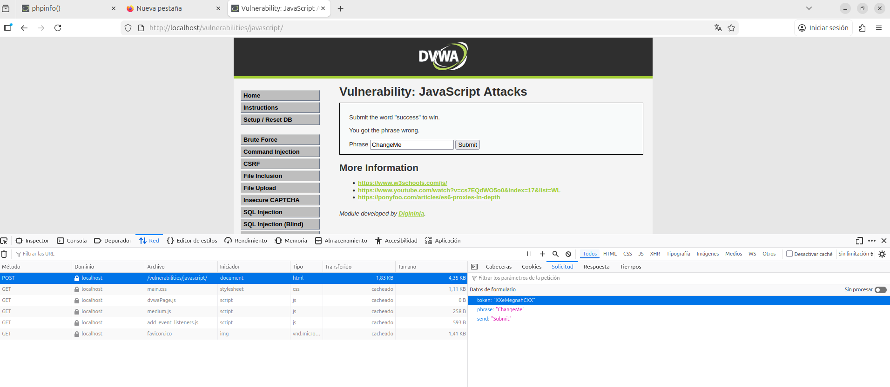
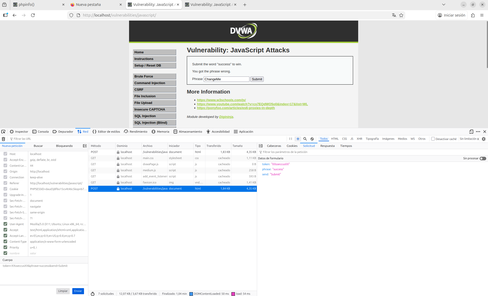
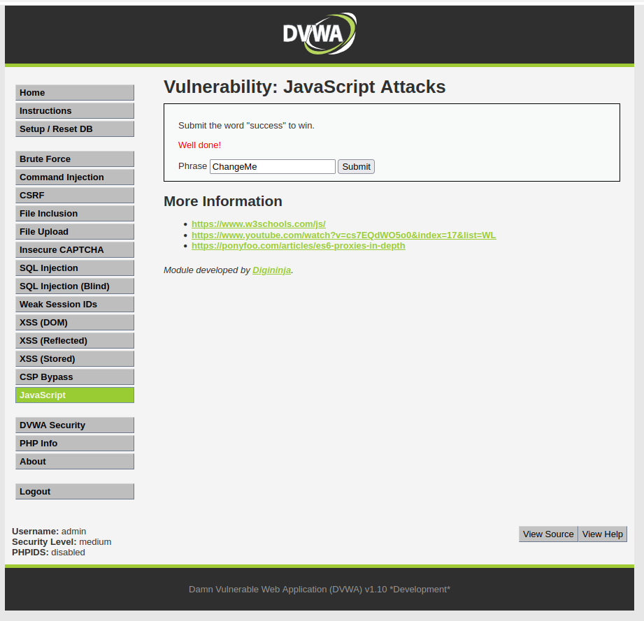

# 13. JavaScript Attacks

##  Descripción
Este módulo evalúa la capacidad de analizar y manipular el código JavaScript que se ejecuta en el navegador. El objetivo es evadir controles que el desarrollador considera seguros mediante la manipulación de la lógica en el cliente. Para superar el reto, se debe enviar la palabra `"success"` junto con un token de validación generado correctamente por un algoritmo oculto en el código fuente.

---

## 13.1. Análisis de niveles y ofuscación

### Nivel Low
Al revisar el código fuente de la página, se revela que el token se genera mediante una combinación simple de los algoritmos **MD5** y **ROT13**. La explotación consiste en replicar manualmente este proceso para generar un token idéntico al que espera el servidor.

### Nivel Medium
En este nivel, el algoritmo cambia para intentar ofuscar la lógica. Tras realizar pruebas con la palabra por defecto `"ChangeMe"`, se obtuvo el token `"XXeMegnahCXX"`. 

**Ingeniería Inversa del patrón:**
Al analizar la cadena resultante, se identificó un patrón de **inversión de texto** y **concatenación** de prefijos/sufijos fijos (`XX` + palabra invertida + `XX`).

---

## 13.2. Evidencia de explotación
Para completar el desafío, se siguió la lógica descubierta anteriormente aplicada a la palabra requerida por el servidor: `"success"`.

1. Se tomó la palabra objetivo: `success`.
2. Se aplicó la inversión: `sseccus`.
3. Se añadieron los caracteres identificados en el patrón: `XXsseccusXX`.
4. Se interceptó la petición y se modificó el valor del token manualmente antes del envío.

### Resultado Final
Tras enviar el token manipulado, el servidor valida la entrada como correcta, otorgando el acceso o mensaje de éxito.

---

## 13.3. Conclusión Técnica (Remediación)
Estos ataques demuestran de forma definitiva que cualquier mecanismo de seguridad implementado exclusivamente en el lado del cliente (JavaScript) es **intrínsecamente inseguro**. 

Dado que el usuario tiene control total sobre su navegador y las herramientas de desarrollo (DevTools), siempre podrá realizar ingeniería inversa del código o interceptar y modificar las peticiones (usando proxies o el inspector de red).

**Medida de Hardening fundamental:**
* **Validación en el Servidor (Server-Side Validation)**: Toda lógica crítica, generación de tokens de integridad y validación de datos debe realizarse exclusivamente en el servidor. El cliente solo debe actuar como una interfaz de presentación.
