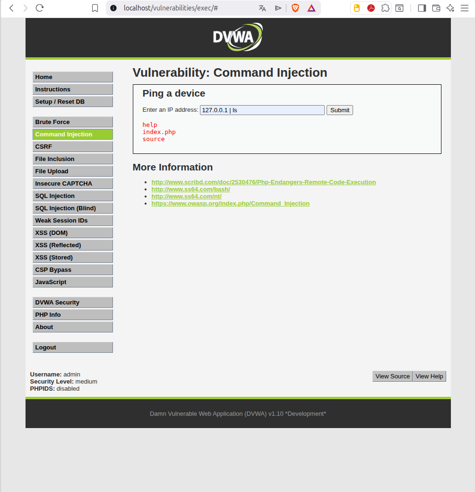
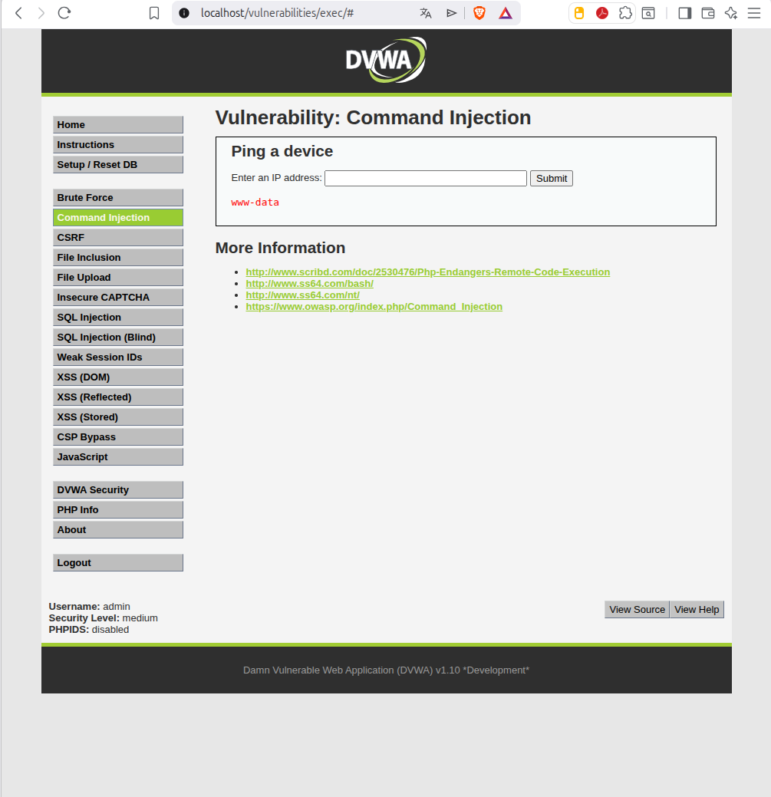
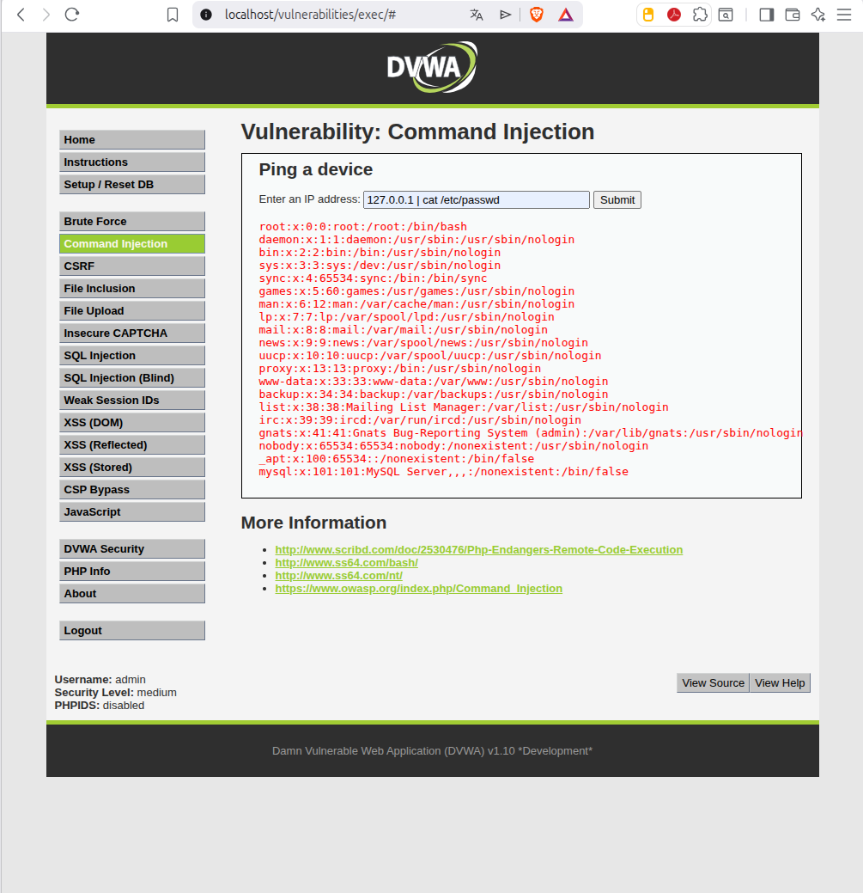

# 2. Inyección de Comandos (Command Injection)

## Descripción
Esta vulnerabilidad ocurre cuando una aplicación envía datos proporcionados por el usuario directamente a una shell del sistema operativo sin una validación o saneamiento adecuado. En este escenario, la aplicación web ofrece una utilidad para realizar un `ping` a un dispositivo de red.

---

## 2.1. Análisis del vector de ataque
La vulnerabilidad reside en la falta de sanitización de la variable `$target`. Internamente, el servidor ejecuta una función similar a la siguiente:

```php
shell_exec("ping  " . $target);

```
Al no filtrar caracteres especiales, es posible inyectar operadores de shell (como la tubería `|`) para encadenar comandos adicionales que el servidor ejecutará con sus propios privilegios.

---

## 2.2. Metodología y Payloads
Se enviaron diversos payloads para confirmar la ejecución remota de comandos y explorar el sistema de archivos:

* **Listado de directorios (`ls`)**: Para verificar los archivos en el servidor.


* **Identificación de usuario (`whoami`)**: Para determinar los privilegios del servicio web.


* **Lectura de archivos sensibles (`cat`)**: Acceso al archivo de usuarios para demostrar el alcance del compromiso.


---

## 2.3. Conclusión técnica
La implementación del nivel **Medium** falla al usar una "lista negra" incompleta. Aunque se bloquearon algunos operadores, se omitieron otros como la tubería (`|`), permitiendo saltar la seguridad.

**Medidas de Hardening:**
1. **Evitar funciones peligrosas**: No usar `shell_exec()` si existen alternativas nativas en PHP.
2. **Validación de entradas**: Implementar una **lista blanca** que solo permita direcciones IP válidas.
3. **Menor privilegio**: Limitar los permisos del usuario `www-data` en el sistema operativo.
