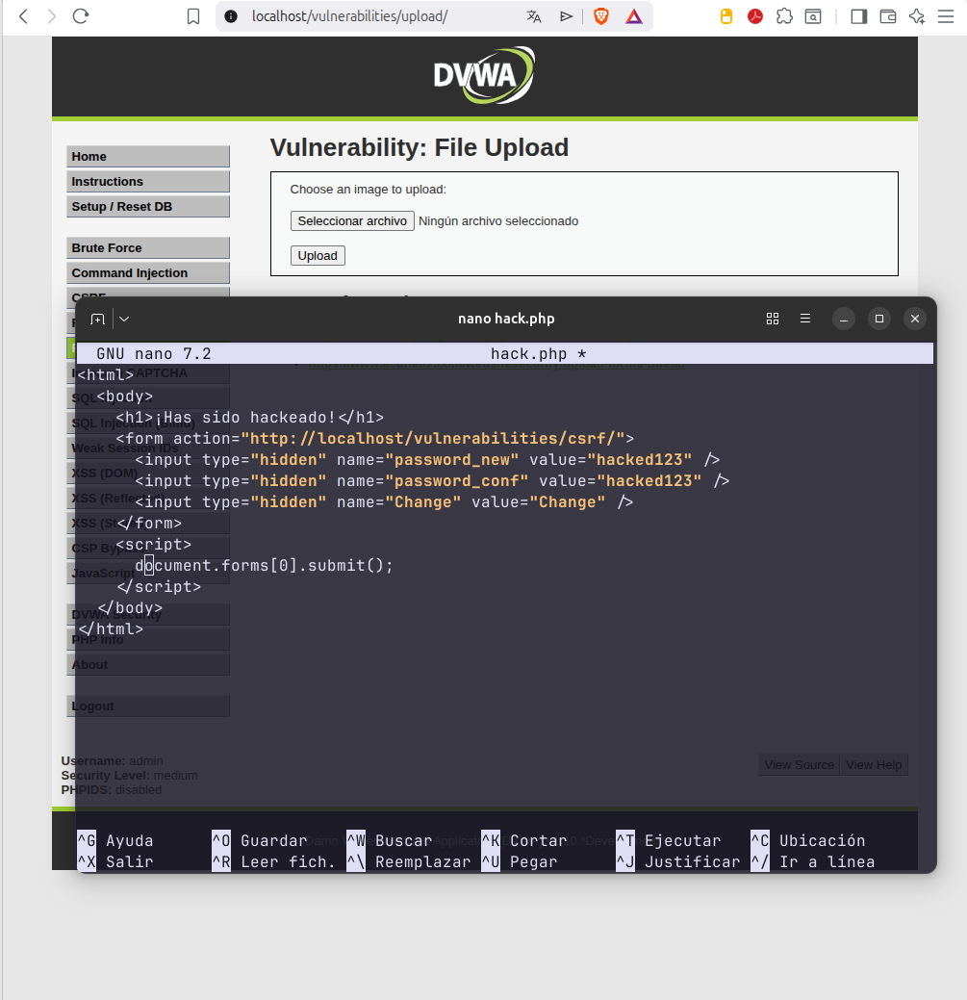
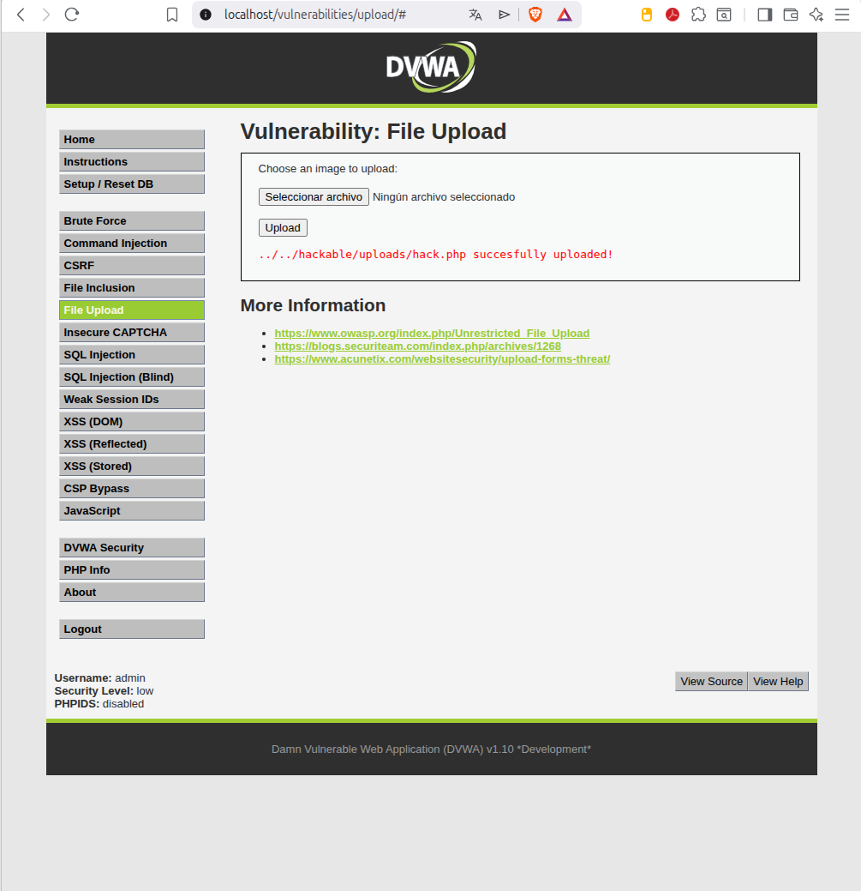
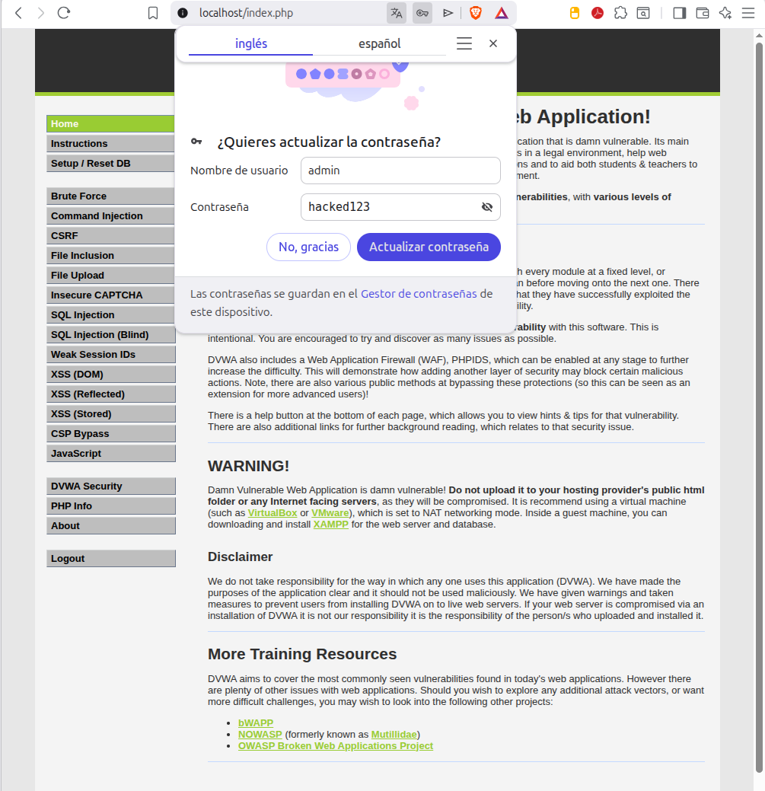

# 3. Cross-Site Request Forgery (CSRF)

## Descripción
El objetivo del ataque CSRF es forzar a un usuario autenticado a realizar acciones no deseadas en una aplicación web. En este escenario, el objetivo es cambiar la contraseña del administrador sin su consentimiento.

---

## 3.1. Análisis de la defensa (Nivel Medium)
En el nivel Medium, el servidor implementa una verificación de la cabecera `HTTP_REFERER`. El servidor comprueba si la petición de cambio de contraseña proviene del propio dominio (`localhost`). Si se intenta el ataque desde una página externa, el servidor la rechazará.

---

## 3.2. Evasión mediante "File Upload" (Ataque Encadenado)
Para evadir esta restricción, se utilizó un ataque encadenado aprovechando la subida de archivos:

* **Creación del exploit**: Se creó un archivo llamado `hack.php` con un formulario HTML oculto y un script en JavaScript que ejecuta el cambio de contraseña automáticamente al cargarse.
* **Subida al servidor**: El archivo se cargó en el directorio `/hackable/uploads/`.
* **Ejecución**: Al estar alojado en el servidor, la petición se origina desde el mismo dominio, engañando la validación del REFERER.

---

## 3.3. Resultado del ataque
Al acceder a la URL del archivo subido (`hack.php`), el navegador ejecuta el código de manera silenciosa, enviando una petición al endpoint de cambio de contraseña sin que el usuario lo note.

---

## 3.4. Conclusión técnica
Se demuestra que una vulnerabilidad menor (como un File Upload mal configurado) puede ser el catalizador para ataques más complejos. La defensa correcta no debe basarse en validar el origen de la petición, sino en implementar **Tokens Anti-CSRF** únicos por sesión.

**Medidas de Hardening recomendadas:**
1.  **Tokens de Sincronización**: Incluir un token aleatorio invisible en cada formulario.
2.  **Atributo SameSite en Cookies**: Configurar cookies como `Strict` o `Lax` para evitar envíos desde sitios externos.
3.  **Re-autenticación**: Solicitar la contraseña actual antes de permitir el cambio a una nueva.
