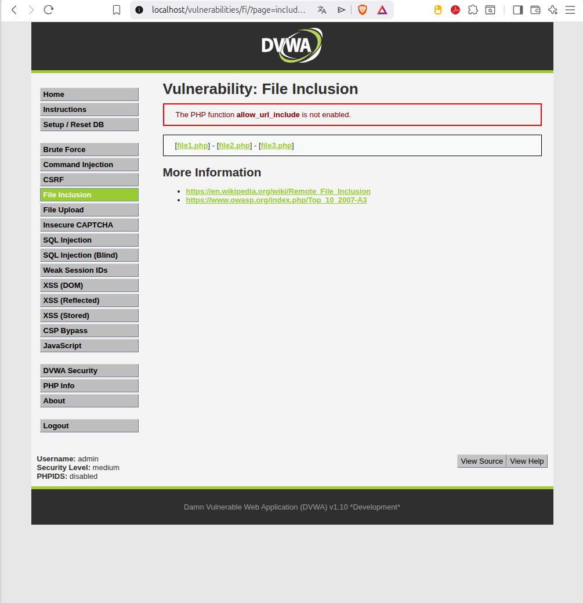
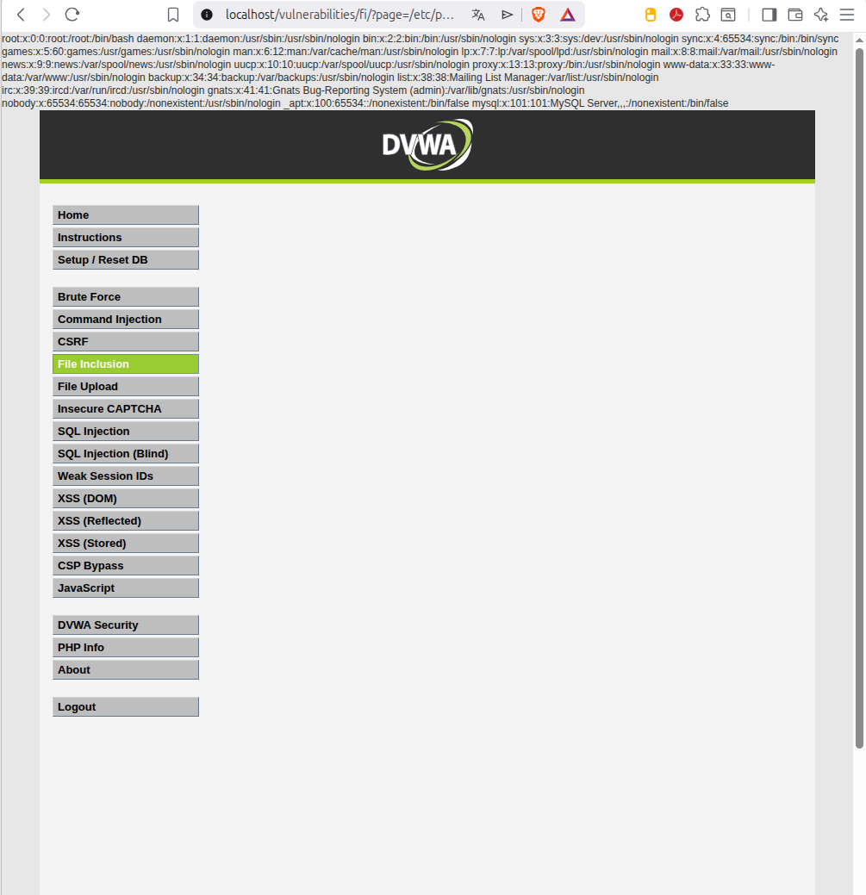

# 4. File Inclusion (LFI)

## Descripción
El objetivo de esta vulnerabilidad es forzar a la aplicación web a cargar y mostrar archivos locales del servidor que no deberían ser accesibles para el usuario. Esto ocurre cuando el parámetro `page` no es correctamente saneado antes de ser procesado por funciones de inclusión en PHP (como `include()` o `require()`).

---

## 4.1. Identificación del vector
El parámetro `page` en la URL es el punto de entrada detectado. En lugar de cargar los archivos legítimos previstos para la interfaz web, el sistema permite manipular la ruta para apuntar a archivos internos del sistema operativo subyacente.

---

## 4.2. Ejecución del exploit
Se procedió a modificar la URL de la aplicación para solicitar un archivo sensible del sistema Linux, utilizando una ruta absoluta:

**Payload utilizado:**
`http://localhost/vulnerabilities/fi/?page=/etc/passwd`

Como se observa en las capturas, el servidor procesa la petición y renderiza el contenido del archivo de usuarios, exponiendo información sobre las cuentas del sistema.

*Estado normal de la aplicación.*

*Exfiltración del archivo /etc/passwd tras la explotación.*

---

## 4.3. Conclusión técnica (Remediación)
El éxito de este ataque confirma que las protecciones basadas en filtros parciales son insuficientes si el atacante utiliza rutas absolutas.

**Medidas de Hardening recomendadas:**
1. **Listas Blancas (Allowlisting)**: Es la mejor práctica. Definir una lista cerrada de archivos permitidos para que cualquier otra petición sea rechazada automáticamente.
2. **Deshabilitar inclusiones remotas**: Asegurar que `allow_url_include` esté en `Off` en la configuración de PHP (`php.ini`).
3. **Aislamiento del sistema de archivos**: Utilizar la directiva `open_basedir` para limitar los directorios a los que PHP puede acceder, evitando que "salte" a carpetas del sistema como `/etc/`.
