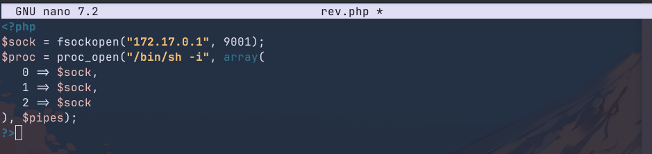
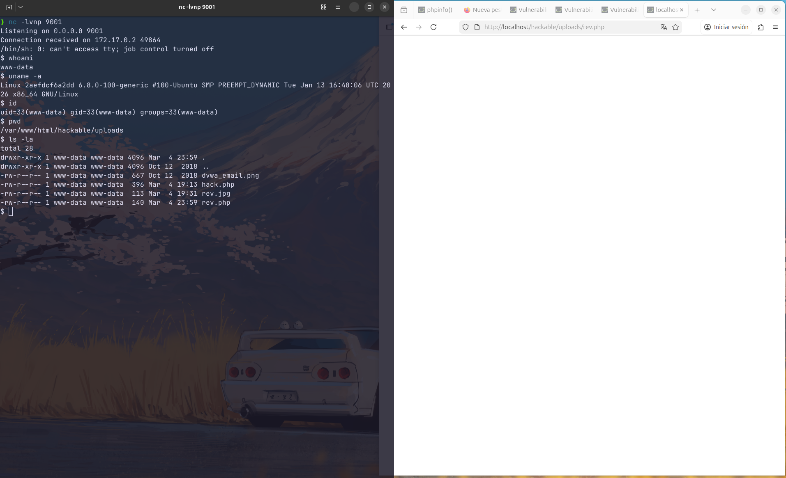

# 5. File Upload: Obtención de Shell Inversa

## Descripción
Esta vulnerabilidad es considerada una de las más críticas (**Remote Code Execution - RCE**), ya que permite al atacante ejecutar código arbitrario en el servidor. El objetivo final es establecer una *Reverse Shell* para tomar el control total del contenedor.

---

## 5.1. Preparación del Payload y la escucha
Se utilizó un script en PHP diseñado para abrir un socket hacia la máquina atacante. Simultáneamente, en la máquina local se configuró un listener para recibir la conexión entrante.

---

## 5.2. Bypass de seguridad (Nivel Medium)
Al intentar subir el archivo directamente, el servidor rechaza la petición indicando que solo se permiten formatos `JPEG` o `PNG`. 

**Técnica de evasión:**
1. Se interceptó la petición `POST` mediante el inspector de red del navegador.
2. Se utilizó la función **"Editar y Reenviar"**.
3. Se modificó la cabecera `Content-Type` de `application/x-php` a `image/png`.

Gracias a esto, el servidor valida la petición como legítima y permite la subida del script malicioso.

---

## 5.3. Resolución de problemas (Networking)
Durante las pruebas iniciales, el archivo se ejecutaba pero la conexión no se establecía. 

**Diagnóstico:** Tras un análisis técnico, se identificó que el **firewall de Ubuntu** (máquina host) estaba bloqueando el tráfico entrante en el puerto de escucha. Fue necesario ajustar las reglas de red para permitir la comunicación entre el contenedor y el host.

---

## 5.4. Resultados
Una vez solventado el bloqueo de red, al acceder a la URL del payload subido, se estableció la conexión de forma inmediata, obteniendo una shell interactiva con los privilegios del servidor web.

---

## 5.5. Conclusión técnica (Hardening)
Restringir la subida de archivos basándose únicamente en la cabecera `Content-Type` es una medida insuficiente, ya que es fácilmente manipulable por el cliente.

**Medidas para una Puesta en Producción Segura:**
1. **Validación del contenido real**: Analizar el archivo en el servidor para verificar su firma real (Magic Bytes).
2. **Aislamiento**: Almacenar los archivos en un servidor o directorio dedicado, fuera de la raíz web si es posible.
3. **Restricción de permisos**: El directorio de subidas debe estar montado con la opción `noexec` para impedir la ejecución de scripts.
4. **Renombrado aleatorio**: Cambiar el nombre del archivo subido a un hash aleatorio para evitar que el atacante conozca la ruta exacta de ejecución.
