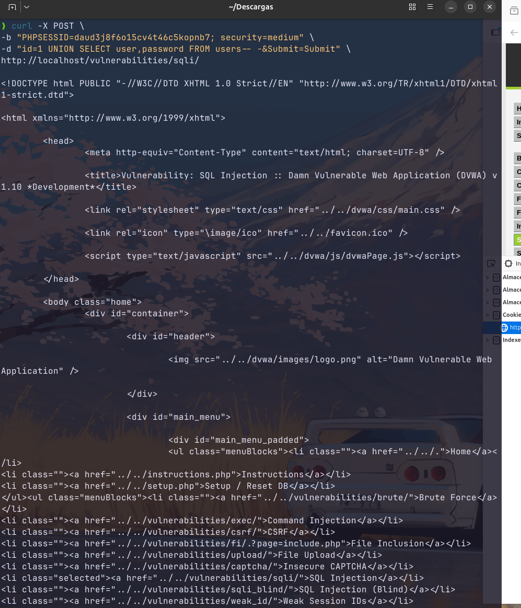
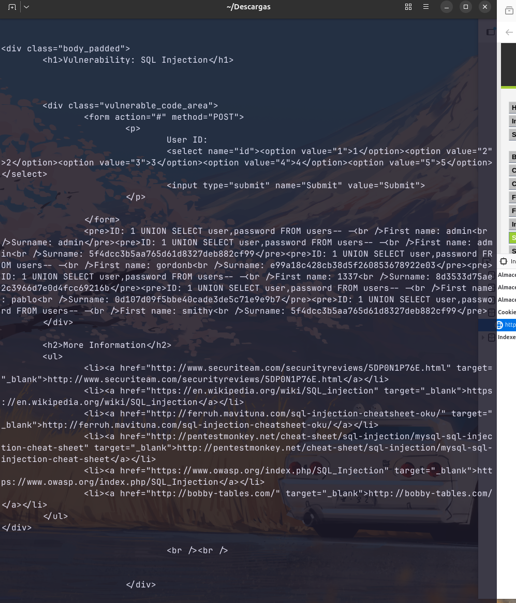

# 6. Inyección SQL (SQL Injection)

## Descripción
El objetivo de esta vulnerabilidad es interferir con las consultas que una aplicación realiza a su base de datos. Mediante la inyección de comandos SQL maliciosos, se logra exfiltrar información sensible, como nombres de usuario y hashes de contraseñas de la tabla de usuarios.

---

## 6.1. Análisis de niveles y evasión

### Nivel Low
La aplicación no realiza ningún tipo de saneamiento. Una simple comilla (`'`) rompe la estructura de la consulta original, permitiendo el uso de operadores lógicos como `OR 1=1` para extraer todos los registros de la tabla de forma indiscriminada.

### Nivel Medium
La aplicación emplea funciones para filtrar comillas (como `mysql_real_escape_string()`). Sin embargo, debido a que el parámetro `id` se trata como un **valor numérico** en la consulta SQL, no es necesario utilizar comillas para inyectar el código malicioso, invalidando así la protección implementada.

---

## 6.2. Metodología de explotación
Para demostrar el ataque y la capacidad de interactuar con el servidor sin usar el navegador, se utilizó el comando `curl` para realizar la petición `POST` directamente desde la terminal, incluyendo las cookies de sesión y el payload SQL.

---

## 6.3. Resultados del ataque
El servidor procesó la consulta alterada y devolvió en el cuerpo de la respuesta HTML el listado completo de la base de datos, incluyendo los hashes de las contraseñas de todos los usuarios registrados.

---

## 6.4. Conclusión Técnica (Remediación)
Este ataque confirma que el uso de listas negras de caracteres (como las comillas) es una medida de seguridad insuficiente y fácilmente evadible. 

**Medida de Hardening definitiva:**
La vulnerabilidad reside en la concatenación directa de variables en la cadena SQL. La solución profesional y segura es el uso de **Consultas Preparadas (Prepared Statements)** con parámetros vinculados. Esto separa estrictamente la lógica de la consulta de los datos proporcionados por el usuario, haciendo imposible que un input sea interpretado como código ejecutable.
