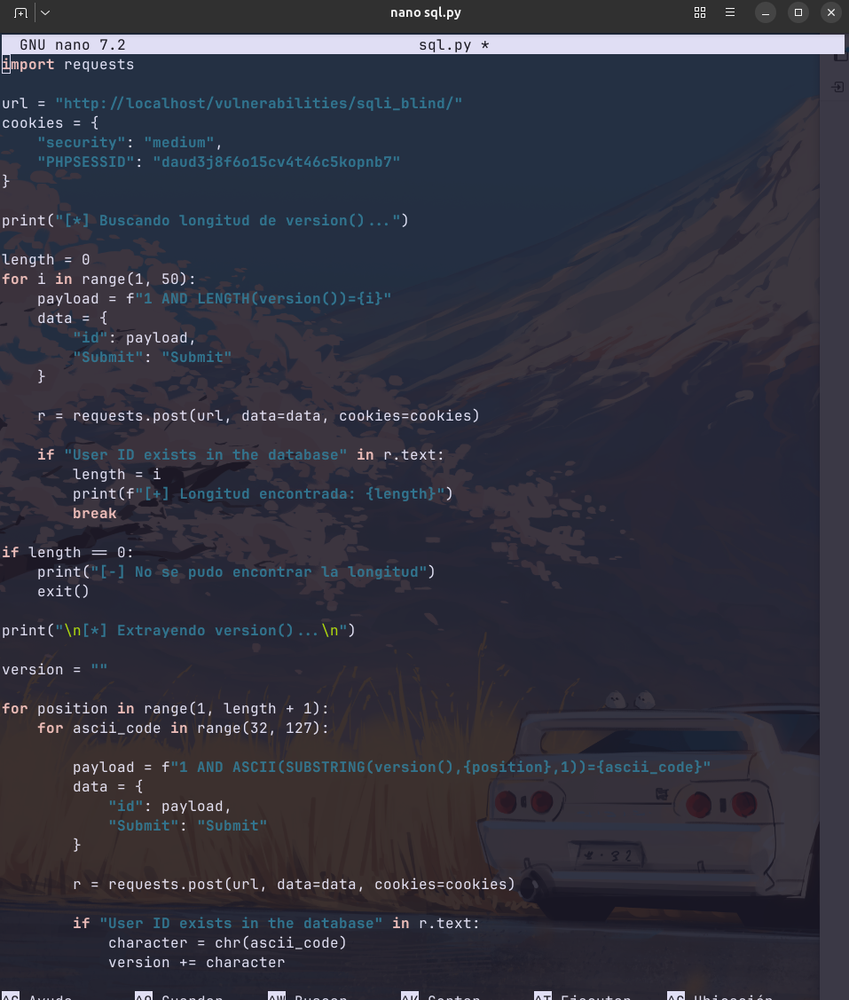
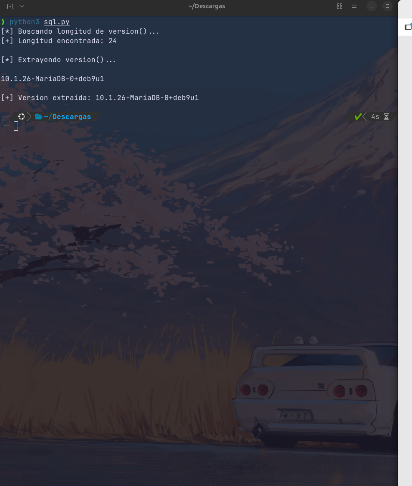

# 7. Blind SQL Injection (Inyección SQL Ciega)

## Descripción
A diferencia de la inyección SQL convencional, en la modalidad **Blind** el servidor no devuelve datos de la base de datos directamente en la interfaz. La aplicación solo ofrece una respuesta binaria (ej. "User ID is available" o "User ID is MISSING"). Para extraer información, es necesario realizar "preguntas" booleanas al servidor y analizar su respuesta o el tiempo de ejecución.

---

## 7.1. Detección y Metodología
La vulnerabilidad se confirmó mediante una **prueba de tiempo (Time-based SQLi)**. Al enviar el siguiente payload:
`1' AND SLEEP(5)#`

El servidor demoró exactamente 5 segundos en responder, lo que confirma que el motor de la base de datos está procesando y ejecutando comandos inyectados.

---

## 7.2. Automatización con Python (Scripting)
Extraer información como la versión de la base de datos carácter por carácter de forma manual es inviable en un entorno real. Por ello, se desarrolló un **script en Python** utilizando la librería `requests` para automatizar el proceso de **Inferencia Booleana**.

**Lógica del script:**
Mediante un bucle anidado, el script recorre cada posición de la cadena de texto y prueba todos los caracteres imprimibles (ASCII) hasta que la condición enviada resulta verdadera, reconstruyendo así la información oculta.

*Script desarrollado para la exfiltración de datos.*

---

## 7.3. Resultados obtenidos
Gracias a la automatización, el script logró reconstruir la cadena completa correspondiente a la versión del Sistema Gestor de Base de Datos (SGBD) de forma eficiente:

---

## 7.4. Conclusión Técnica (Remediación)
Este ataque demuestra que la **seguridad por oscuridad** (ocultar errores o salidas de datos) no es una protección real. Un atacante con scripts personalizados puede filtrar bases de datos completas a pesar de no recibir respuestas directas.

**Medida de Hardening recomendada:**
Al igual que en la SQLi convencional, la protección definitiva es el uso de **consultas preparadas**. Al separar los datos de la lógica de la consulta, se impide que comandos como `SLEEP()` o comparaciones booleanas sean interpretados por el motor de la base de datos.
