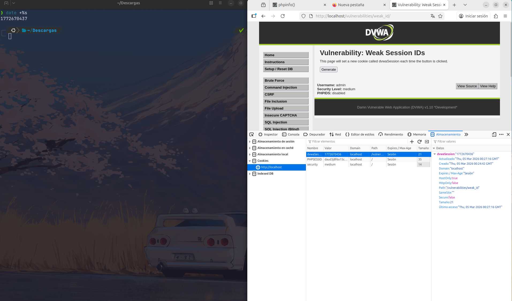

# 8. IDs de Sesión Débiles (Weak Session IDs)

## Descripción
Esta vulnerabilidad ocurre cuando el identificador de sesión (cookie) generado por el servidor es predecible. Si un atacante puede adivinar o calcular el ID de sesión de otro usuario, puede realizar un **secuestro de sesión (Session Hijacking)**, accediendo a la cuenta de la víctima sin necesidad de conocer su contraseña.

---

## 8.1. Análisis de predictibilidad

### Nivel Low
En este nivel, el identificador de sesión es un simple **contador secuencial** (1, 2, 3...). Es extremadamente vulnerable, ya que un atacante solo necesita incrementar en uno el valor de su propia cookie para suplantar al siguiente usuario que inicie sesión en el sistema.

### Nivel Medium
La aplicación intenta mejorar la seguridad utilizando una **marca de tiempo de Unix (Unix Timestamp)**. El servidor genera el ID mediante la función `time()`, que representa los segundos transcurridos desde el 1 de enero de 1970. Aunque parece aleatorio a simple vista, sigue siendo un valor predecible basado en el tiempo.

---

## 8.2. Evidencia de explotación (Nivel Medium)
Para demostrar la debilidad, se comparó el valor de la cookie generada por DVWA con la salida del comando `date +%s` en la terminal de Linux (que muestra el timestamp actual).

**Resultado del análisis:**
Como se observa en la captura, la diferencia es de apenas 1 segundo entre el valor de la terminal y el valor de la cookie. Esto confirma que el ID de sesión es simplemente el tiempo actual del servidor. Un atacante solo tendría que realizar un ataque de fuerza bruta en un rango de tiempo cercano para encontrar y secuestrar una sesión activa.

---

## 8.3. Conclusión Técnica (Remediación)
La predictibilidad en los identificadores de sesión anula cualquier otro mecanismo de autenticación robusto.

**Medidas de Hardening recomendadas:**
1. **Generadores Criptográficos (CSPRNG)**: Los IDs deben generarse utilizando algoritmos de números aleatorios criptográficamente seguros.
2. **Alta Entropía**: El identificador debe tener una longitud suficiente (mínimo 128 bits) para que sea estadísticamente imposible de predecir mediante fuerza bruta.
3. **Regeneración de ID**: Es vital regenerar el ID de sesión después de cada cambio de estado de privilegios (como el login) para evitar ataques de fijación de sesión.
