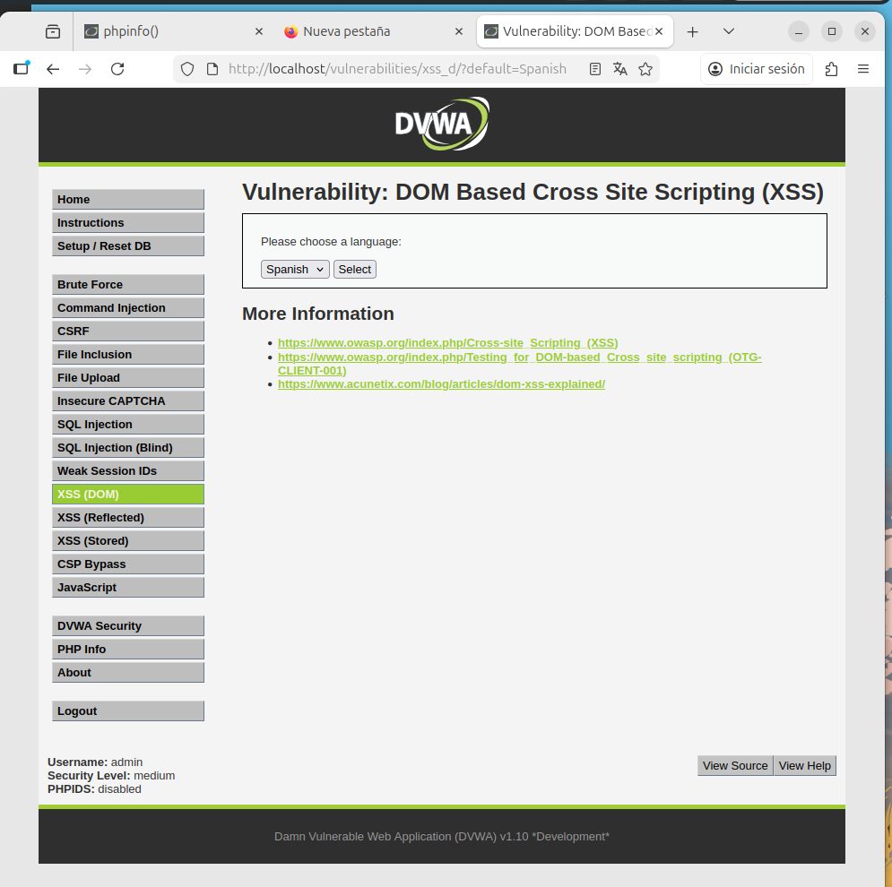
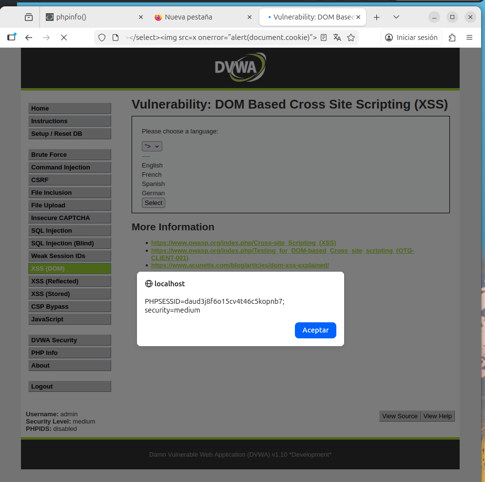

# 9. DOM Based Cross Site Scripting (XSS)

## Descripción
A diferencia del XSS persistente o reflejado, el **DOM XSS** ocurre cuando la aplicación contiene un script en el lado del cliente (JavaScript) que procesa datos de una fuente no confiable de manera insegura. La vulnerabilidad se ejecuta íntegramente en el navegador de la víctima al escribir datos maliciosos de vuelta en el Document Object Model (DOM).

---

## 9.1. Análisis de niveles y evasión

### Nivel Low
En este nivel, la aplicación toma directamente el parámetro `default` de la URL y lo utiliza para renderizar la página mediante JavaScript. Al no existir validación ni filtrado, el navegador ejecuta cualquier etiqueta `<script>` que se inyecte en la URL.

### Nivel Medium
El desarrollador ha implementado una **lista negra** que bloquea específicamente la etiqueta `<script>`. Sin embargo, esta protección es insuficiente ya que solo busca una cadena de texto concreta, permitiendo otros vectores de ejecución de JavaScript.

---

## 9.2. Evidencia de explotación
Para evadir la restricción del nivel Medium, se utilizó una técnica de **cierre de etiquetas** y el uso de **eventos de HTML** que no dependen de la etiqueta bloqueada. 

**Payload utilizado:**
`?default=English</option>`

1. Se cierra la etiqueta legítima `</option>`.
2. Se inserta una etiqueta de imagen con una fuente inválida (`src=x`).
3. Se utiliza el atributo `onerror` para ejecutar el código JavaScript deseado.

---

## 9.3. Conclusión Técnica (Remediación)
El DOM XSS es particularmente peligroso porque el payload puede viajar en el fragmento de la URL (tras el símbolo `#`), lo que significa que **nunca llega al servidor**. Esto lo hace invisible para muchos Firewalls de Aplicación Web (WAF) tradicionales.

**Medidas de Hardening recomendadas:**
1. **Uso de APIs seguras**: Evitar funciones peligrosas como `.innerHTML()` o `document.write()`. En su lugar, utilizar `.textContent()` o `.innerText()`, que tratan la entrada exclusivamente como texto plano.
2. **Sanitización en el cliente**: Utilizar librerías probadas como *DOMPurify* para limpiar cualquier dato antes de insertarlo en el DOM.
3. **Content Security Policy (CSP)**: Implementar políticas de seguridad que restrinjan la ejecución de scripts *inline* y el uso de manejadores de eventos como `onerror`.
